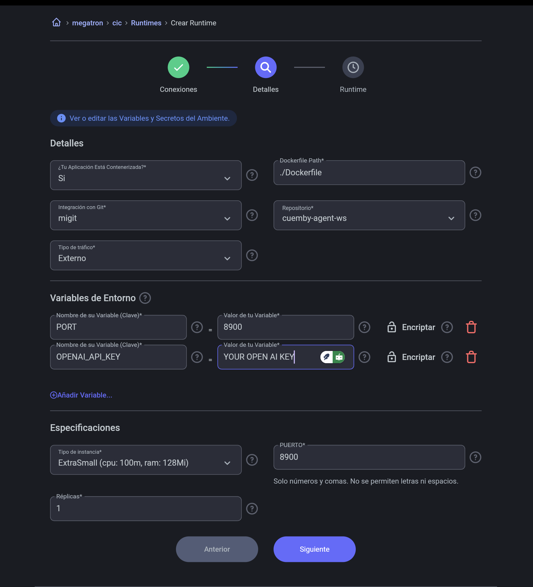
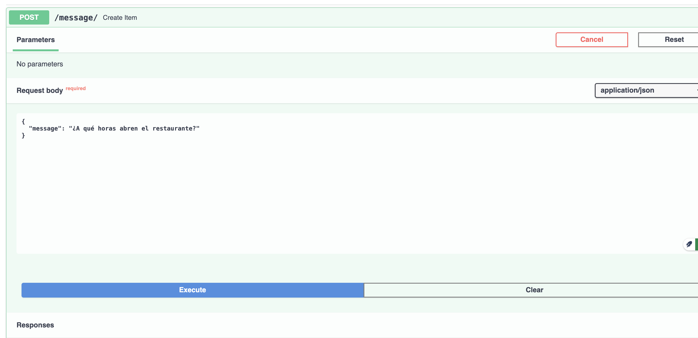
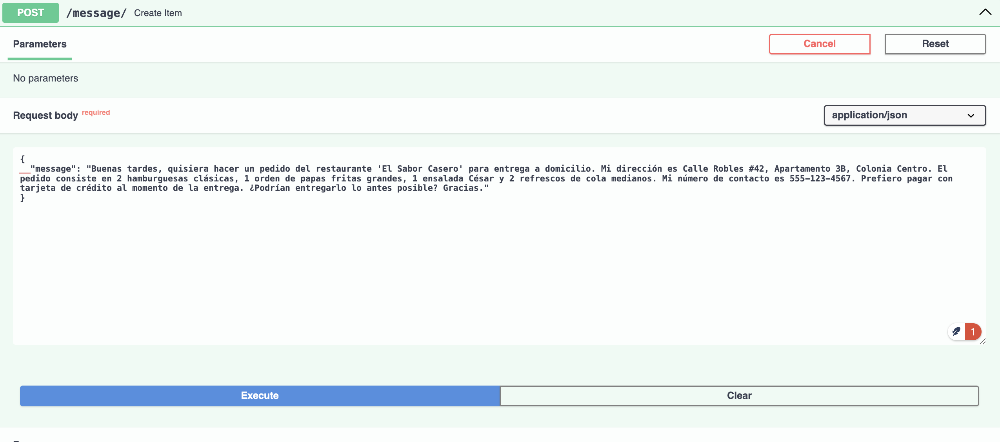

# Desarrollando un agente de AI en Cuemby Platform

Los agentes de IA representan una de las fronteras más emocionantes en el campo de la inteligencia artificial. A diferencia de los sistemas de IA tradicionales que operan dentro de parámetros estrictamente definidos, los agentes de IA poseen la capacidad de actuar con cierto grado de autonomía en su entorno digital.

En su forma más simple, un agente de IA es un programa informático que puede:

- Percibir su entorno a través de datos e información.
- Tomar decisiones basadas en esos datos.
- Ejecutar acciones que afectan a su entorno.
- Aprender de los resultados para mejorar decisiones futuras.

En este blog, desarrollaremos un agente utilizando **LangGraph** y lo desplegaremos en **Cuemby Platform**.

## ¿Qué es LangGraph?

LangGraph es un framework diseñado específicamente para construir agentes de inteligencia artificial utilizando grafos de estado. Esta herramienta simplifica la creación de agentes que pueden mantener estados persistentes y tomar decisiones complejas a lo largo del tiempo.

LangGraph extiende la funcionalidad de **LangChain**, permitiendo desarrollar aplicaciones de IA que requieren mantener un estado interno y seguir flujos de trabajo definidos por el desarrollador. Es especialmente útil para implementar patrones como:

- **ReAct (Reasoning and Acting):** donde el agente alterna entre razonamiento y acción.
- **Reflexión:** donde el agente evalúa sus propias decisiones.
- **Planificación y ejecución:** donde el agente elabora un plan y luego lo implementa.

## El plan

Imagine que trabaja para una empresa que transporta alimentos de restaurantes a los domicilios de las personas. Recibe bastantes mensajes al día, entre ellos solicitudes de entrega y, por otro lado, preguntas sobre el restaurante.

### Ejemplo de solicitud de entrega

> Buenas tardes, quisiera hacer un pedido del restaurante 'El Sabor Casero' para entrega a domicilio. Mi dirección es Calle Robles #42, Apartamento 3B, Colonia Centro. El pedido consiste en 2 hamburguesas clásicas, 1 orden de papas fritas grandes, 1 ensalada César y 2 refrescos de cola medianos. Mi número de contacto es 555-123-4567. Prefiero pagar con tarjeta de crédito al momento de la entrega. ¿Podrían entregarlo lo antes posible? Gracias.

### Ejemplo de solicitud PQRS

> Buenas noches. Solicité un pedido del restaurante 'La Parrilla Dorada' hace más de 2 horas (número de orden #4582) y aún no ha llegado. Mi dirección es Avenida Principal #78, Torre B, Apto 502. Ya intenté comunicarme con el restaurante y me indicaron que el pedido salió hace más de una hora. Necesito saber dónde está mi pedido o solicitar un reembolso inmediato. Mi número de contacto es 555-789-0123.

El flujo será sencillo: primero categorizamos el mensaje de entrada del usuario y verificamos si es una orden o no. Posteriormente, si es una orden, realizamos un proceso de extracción de la orden; y si es una consulta, se procede a responder al usuario. La siguiente imagen muestra el flujo de nuestro agente de servicio al cliente:


## Código

Lo primero que debemos entender es que LangGraph funciona mediante nodos, edges y nodos condicionales. Los veremos más adelante.

```python
"""
Restaurant Service Workflow
----------------------------
This module implements a LangGraph workflow for handling restaurant-related
customer interactions, classifying them as either order requests or questions,
and processing them accordingly.
"""

import os
import logging
from enum import Enum
from typing import List, Optional
from typing_extensions import TypedDict

from pydantic import BaseModel
from langchain_core.messages import SystemMessage, HumanMessage
from langchain_openai import ChatOpenAI
from langgraph.graph import StateGraph, START, END

# Configure logging
logging.basicConfig(
    level=logging.INFO, format="%(asctime)s - %(name)s - %(levelname)s - %(message)s"
)
logger = logging.getLogger("restaurant_service")

# Configure OpenAI API
os.environ["OPENAI_API_KEY"] = (
    "YOUR_OPENAI_API_KEY"
)
llm = ChatOpenAI(model="gpt-4o-2024-08-06")
```

En el bloque anterior, importamos todos los paquetes necesarios. LangGraph funciona como una máquina de estados, y los estados están definidos por **StateGraph**. Por otro lado, **START** y **END** definen los nodos de entrada y el de finalización. También definimos la LLM a utilizar; en nuestro caso, usaremos **OpenAI** y el modelo **gpt-4o**.

## Objeto de estado

```python
class State(TypedDict):
    """State management for the workflow."""

    message_type: str
    extraction: dict
    user_response: str
    message_content: str
```

En LangGraph, el estado se puede definir mediante un objeto **TypedDict** o un esquema de **Pydantic**. En este caso, utilizaremos **TypedDict** y definimos como variables:

- **message_type:** donde se asignará la clasificación del mensaje.
- **extraction:** para obtener de manera estructurada los datos relevantes.
- **user_response:** lo usaremos para darle una respuesta al usuario si es una pregunta.
- **message_content:** guardará el mensaje original.

## Clasificación

Vamos a definir nuestro primer nodo en Langraph. Los nodos son funciones que como parametro se le ingresa el estado.

```python
def classification_node(state: State) -> State:
    """
    Classifies incoming messages as either ORDER or QUESTION.

    Args:
        state: Current workflow state

    Returns:
        Updated state with message classification
    """
    current_message = state["message_content"]
    human_message = HumanMessage(content=current_message)
    system_message = SystemMessage(content=CLASSIFIER_SYSTEM_PROMPT)

    logger.info("Classifying customer message")
    message_type = llm.invoke([system_message, human_message])

    # Store the classification result
    state["message_type"] = message_type.content.upper()
    logger.info(f"Message classified as: {state['message_type']}")

    return state

```

Esta función classification_node es un nodo en un grafo de LangGraph que se encarga de clasificar los mensajes entrantes en dos categorías: "ORDER" (pedido) o "QUESTION" (pregunta).
En detalle:

- Recibe el estado actual del flujo de trabajo como parámetro
- Extrae el contenido del mensaje actual del estado
- Crea un mensaje del tipo "humano" con ese contenido
- Crea un mensaje del tipo "sistema" con un prompt predefinido para clasificación
- Usa un modelo de lenguaje (LLM) para determinar si el mensaje es un pedido o una pregunta
- Guarda el resultado de la clasificación en el estado, convirtiéndolo a mayúsculas
- Registra el resultado de la clasificación en el log
- Devuelve el estado actualizado

Esta función es una parte crucial del flujo de trabajo porque permite que el sistema dirija los mensajes entrantes hacia diferentes caminos de procesamiento según su tipo.

El prompt de sistema utilizado es el siguiente

> You are a classifier system. Your task is to classify the message as either ORDER or QUESTION. An ORDER is a message that contains a delivery order request. A QUESTION is a message that contains a question about the restaurant. Only respond with: ORDER, QUESTION

De esa forma solo esperamos que la clasificacion nos responda como ORDER, QUESTION

## Extraccion de Ordenes

```python
def order_processor_node(state: State) -> State:
    """
    Processes order requests by extracting structured information.

    Args:
        state: Current workflow state

    Returns:
        Updated state with extracted order information
    """
    current_message = state["message_content"]
    logger.info("Processing order request")

    # Use structured output to extract order details
    llm_with_structured = llm.with_structured_output(OrderRequest)
    extracted_order = llm_with_structured.invoke(current_message)

    # Store the structured order information
    state["extraction"] = extracted_order.model_dump()
    logger.info(f"Order extracted successfully: {state['extraction']['order_id']}")

    return state
```

El componente clave de esta implementación es el uso de **"structured output"**, una característica que permite configurar los modelos de lenguaje para que devuelvan datos en formatos predefinidos y validados.
En el nodo **order_processor_node**, el sistema recibe el mensaje del usuario y lo procesa utilizando una configuración especial del modelo. Al invocar **llm.with_structured_output(OrderRequest)**, estamos indicando al modelo que debe producir una respuesta que se ajuste exactamente a la estructura definida en la clase OrderRequest, típicamente implementada con Pydantic.
Este enfoque elimina la necesidad de escribir prompts complejos o analizar texto libre, ya que el modelo se encarga de extraer y estructurar automáticamente la información relevante. Una vez procesado el mensaje, los datos extraídos se almacenan en el estado del flujo de trabajo como un diccionario, permitiendo que otros componentes del sistema accedan a esta información para continuar con el procesamiento de la orden.
La principal ventaja de este método es la robustez: al utilizar esquemas predefinidos, se garantiza la consistencia de los datos extraídos y se minimiza la posibilidad de errores de interpretación, haciendo que el sistema sea más confiable incluso cuando maneja solicitudes expresadas de formas variadas o ambiguas.

El esquema que queremos ajustar es el que se muestra a continuación:
```python
# Define data models
class PaymentMethod(str, Enum):
    """Supported payment methods for orders."""

    CASH = "cash"
    CREDIT_CARD = "credit_card"
    DEBIT_CARD = "debit_card"
    BANK_TRANSFER = "bank_transfer"


class OrderItem(BaseModel):
    """Represents an individual item in an order."""

    name: str
    quantity: int
    notes: Optional[str] = None
    unit_price: Optional[float] = None


class OrderRequest(BaseModel):
    """Represents a complete order request from a customer."""

    order_id: Optional[str] = None
    restaurant: str
    request_date: str
    delivery_address: str
    items: List[OrderItem]
    contact: str
    payment_method: PaymentMethod = PaymentMethod.CASH
    express_delivery: bool
    additional_notes: Optional[str] = None

```

## Arista condicional
```python
def message_type_router(state: State) -> str:
    """
    Routes the workflow based on the message classification.

    Args:
        state: Current workflow state

    Returns:
        Name of the next node to execute
    """
    if state["message_type"] == "ORDER":
        logger.info("Routing to order processor")
        return "order_processor_node"
    elif state["message_type"] == "QUESTION":
        logger.info("Routing to question processor")
        return "question_processor_node"
    else:
        logger.warning(f"Unknown message type: {state['message_type']}")
        return "question_processor_node"  # Default fallback
```
El componente message_type_router funciona como un distribuidor de tráfico en el flujo de trabajo de LangGraph. Examina el valor de **state["message_type"]** y, basándose en esta clasificación, determina cuál será el siguiente nodo a ejecutar.
Si el mensaje es una orden ("ORDER"), dirige el flujo hacia el procesador de órdenes. Si es una pregunta ("QUESTION"), lo envía al procesador de preguntas. Para cualquier otro tipo no reconocido, registra una advertencia y utiliza el procesador de preguntas como opción predeterminada.
Este mecanismo permite que el sistema responda de manera específica según el tipo de solicitud, aplicando el procesamiento más adecuado para cada caso.

## Flujo de Trabajo con StateGraph

```python
# Build workflow graph
def build_workflow():
    """
    Builds and returns the compiled workflow graph.

    Returns:
        Compiled workflow
    """
    logger.info("Building restaurant service workflow")

    # Initialize the graph
    graph = StateGraph(State)

    # Add nodes
    graph.add_node("classification_node", classification_node)
    graph.add_node("order_processor_node", order_processor_node)
    graph.add_node("question_processor_node", question_processor_node)

    # Add edges
    graph.add_edge(START, "classification_node")
    graph.add_conditional_edges("classification_node", message_type_router)
    graph.add_edge("order_processor_node", END)
    graph.add_edge("question_processor_node", END)

    # Compile the workflow
    workflow = graph.compile()
    logger.info("Workflow compiled successfully")

    return workflow
```
### Inicialización

La línea `graph = StateGraph(State)` crea un nuevo **grafo de estado**, usando la clase `State` como estructura para mantener la información a lo largo del flujo.

---

### Adición de Nodos

- `add_node` registra funciones como componentes del flujo de trabajo.
- Cada llamada a `add_node` toma dos parámetros:
  - Un **nombre único** para identificar el nodo.
  - La **función** que se ejecutará cuando el flujo llegue a ese nodo.
- Se añaden tres nodos:
  - Uno para **clasificación**.
  - Otro para **procesar órdenes**.
  - Un tercero para **procesar preguntas**.

---

### Configuración de Conexiones

- `add_edge` establece una conexión directa entre dos nodos, definiendo el camino que seguirá el flujo.
  - `START` es un nodo especial que marca el punto de entrada al flujo, conectándose al nodo de **clasificación**.

- `add_conditional_edges` crea conexiones **dinámicas** basadas en una **función de enrutamiento** (en este caso, `message_type_router`).
  - Esta función determina a qué nodo se dirigirá el flujo según el resultado de la clasificación.

- Tanto el **procesador de órdenes** como el de **preguntas** se conectan al nodo especial `END`, que marca la finalización del flujo.

---

### Compilación

- `workflow = graph.compile()` transforma la definición del grafo en un **objeto ejecutable**.
- La compilación **valida la estructura del grafo**, asegurando que todas las rutas sean válidas y alcanzables.
- El resultado es un **flujo de trabajo listo** para procesar mensajes según la lógica definida.

## Ejecución

Para ejecutar un grafo de LangGraph, necesitamos llamar al método invoke. Con esto, se desencadena todo el workflow que hemos construido hasta ahora.

Por ejemplo, ejecutemos el grafo con una solicitud de orden:
> Buenas tardes, quisiera hacer un pedido del restaurante 'El Sabor Casero' para entrega a domicilio. Mi dirección es Calle Robles #42, Apartamento 3B, Colonia Centro. El pedido consiste en 2 hamburguesas clásicas, 1 orden de papas fritas grandes, 1 ensalada César y 2 refrescos de cola medianos. Mi número de contacto es 555-123-4567. Prefiero pagar con tarjeta de crédito al momento de la entrega. ¿Podrían entregarlo lo antes posible? Gracias. 

```python
    order_result = restaurant_service.invoke({"message_content": order_example})

```

El resultado sería el siguiente:
```sh
 restaurant_service - INFO - Building restaurant service workflow
 restaurant_service - INFO - Workflow compiled successfully
 restaurant_service - INFO - Testing workflow with an order
 restaurant_service - INFO - Classifying customer message
 httpx - INFO - HTTP Request: POST https://api.openai.com/v1/chat/completions "HTTP/1.1 200 OK"
 restaurant_service - INFO - Message classified as: ORDER
 restaurant_service - INFO - Routing to order processor
 restaurant_service - INFO - Processing order request
 httpx - INFO - HTTP Request: POST https://api.openai.com/v1/chat/completions "HTTP/1.1 200 OK"
 restaurant_service - INFO - Order extracted successfully: None
 restaurant_service - INFO - Order processing result: {'order_id': None, 'restaurant': 'El Sabor Casero', 'request_date': '2023-11-01T16:00:00Z', 'delivery_address': 'Calle Robles #42, Apartamento 3B, Colonia Centro', 'items': [{'name': 'hamburguesa clásica', 'quantity': 2, 'notes': None, 'unit_price': None}, {'name': 'papa fritas grandes', 'quantity': 1, 'notes': None, 'unit_price': None}, {'name': 'ensalada César', 'quantity': 1, 'notes': None, 'unit_price': None}, {'name': 'refresco de cola mediano', 'quantity': 2, 'notes': None, 'unit_price': None}], 'contact': '555-123-4567', 'payment_method': <PaymentMethod.CREDIT_CARD: 'credit_card'>, 'express_delivery': True, 'additional_notes': 'Entregar lo antes posible. Prefiero pago con tarjeta de crédito al momento de la entrega.'}
```

Ahora, hagamos la prueba con una pregunta que no es una orden:
> What are your opening hours on weekends? Do you offer vegetarian options?

```sh
 restaurant_service - INFO - Building restaurant service workflow
 restaurant_service - INFO - Workflow compiled successfully
 restaurant_service - INFO - Testing workflow with an order
 restaurant_service - INFO - Classifying customer message
 httpx - INFO - HTTP Request: POST https://api.openai.com/v1/chat/completions "HTTP/1.1 200 OK"
 restaurant_service - INFO - Message classified as: QUESTION
 restaurant_service - INFO - Routing to question processor
 restaurant_service - INFO - Processing customer question
 httpx - INFO - HTTP Request: POST https://api.openai.com/v1/chat/completions "HTTP/1.1 200 OK"
 restaurant_service - INFO - Generated response to customer question
 restaurant_service - INFO - Question processing result: Our opening hours on weekends are from 8:00 AM to 11:00 PM. Yes, we do offer vegetarian options on our menu. A technical support representative will assist you shortly for any further inquiries.
 ```

 # Llevando a produccion
 ```python
from fastapi import FastAPI, HTTPException
from pydantic import BaseModel
import uvicorn

app = FastAPI()


class Message(BaseModel):
    message: str


@app.post("/message/")
async def create_item(message: Message):
    workflow = build_workflow()
    try:
        response = workflow.invoke({"message_content": message.message})
    except Exception as e:
        raise HTTPException(status_code=400, detail=str(e))
    return {"message": response}


if __name__ == "__main__":
    uvicorn.run(app, host="0.0.0.0", port=8900)

  ```


Este código implementa un servicio web con FastAPI, un framework de Python para desarrollar APIs web de forma rápida y sencilla.

Se importan las bibliotecas necesarias: FastAPI para crear la API, HTTPException para manejar errores, BaseModel para definir modelos de datos, y uvicorn que actuará como servidor web.

Después crea una instancia de FastAPI y define un modelo de datos llamado "Message" que especifica la estructura que deben tener los mensajes entrantes, que consiste simplemente en un campo de texto.
El núcleo del servicio es un punto de acceso (endpoint) que responde a solicitudes POST en la ruta "/message/". Cuando recibe un mensaje, el servicio construye un "workflow" (aunque la función build_workflow() no está definida en este fragmento) y le pasa el contenido del mensaje recibido. Si el proceso se ejecuta correctamente, devuelve la respuesta del workflow al cliente. Si ocurre algún error durante este proceso, captura la excepción y responde con un error HTTP 400.

Finalmente, el código verifica si el script se está ejecutando directamente (no como un módulo importado). En ese caso, inicia un servidor Uvicorn que hace que la API esté disponible en todas las interfaces de red (0.0.0.0) usando el puerto configurado anteriormente.

## Cuemby Cloud Platform

En el repositorio tenemos tres archivos importantes: Dockerfile, requirements.txt y agent.py. El primero es un Dockerfile sencillo para desplegar una aplicación HTTP. En requirements.txt se encuentran los paquetes a instalar y, finalmente, en agent.py se encuentra el código que hemos ido construyendo.
Para crear su cuenta en Cuemby Platform puede dirigirse a [console.cuemby.com](https://console.cuemby.io/) y seguir los siguientes pasos para crear un runtime https://www.cuemby.com/en-us/developer-hub/docs/deploy-your-first-application



Es importante asignar las variables de entorno *PORT* y *OPEN_AI_KEY* para que funcione correctamente.
Una vez desplegada nuestra aplicación podemos dirigirnos la ruta /docs 

Ahora, probmenos nuestro endpoint.



El resultado es:
```sh
{
  "message": {
    "message_type": "QUESTION",
    "user_response": "El restaurante abre sus puertas a las 9:00 AM todos los días. Si necesita más ayuda, será atendido por soporte técnico en breve.",
    "message_content": "¿A qué horas abren el restaurante?"
  }
}```




El resultado es:

```sh
{
  "message": {
    "message_type": "ORDER",
    "extraction": {
      "order_id": null,
      "restaurant": "El Sabor Casero",
      "request_date": "2023-11-01",
      "delivery_address": "Calle Robles #42, Apartamento 3B, Colonia Centro",
      "items": [
        {
          "name": "Hamburguesa Clásica",
          "quantity": 2,
          "notes": null,
          "unit_price": null
        },
        {
          "name": "Papas Fritas Grandes",
          "quantity": 1,
          "notes": null,
          "unit_price": null
        },
        {
          "name": "Ensalada César",
          "quantity": 1,
          "notes": null,
          "unit_price": null
        },
        {
          "name": "Refresco de Cola Mediano",
          "quantity": 2,
          "notes": null,
          "unit_price": null
        }
      ],
      "contact": "555-123-4567",
      "payment_method": "credit_card",
      "express_delivery": true,
      "additional_notes": null
    },
    "message_content": "Buenas tardes, quisiera hacer un pedido del restaurante 'El Sabor Casero' para entrega a domicilio. Mi dirección es Calle Robles #42, Apartamento 3B, Colonia Centro. El pedido consiste en 2 hamburguesas clásicas, 1 orden de papas fritas grandes, 1 ensalada César y 2 refrescos de cola medianos. Mi número de contacto es 555-123-4567. Prefiero pagar con tarjeta de crédito al momento de la entrega. ¿Podrían entregarlo lo antes posible? Gracias."
  }
}

```


# Conclusiones

El desarrollo de agentes inteligentes marca una evolución significativa en la forma en que interactuamos con sistemas automatizados. En este ejemplo, construimos un agente de servicio al cliente capaz de distinguir entre órdenes de comida y consultas generales, extrayendo información estructurada de forma precisa y ofreciendo respuestas contextuales.

Gracias a herramientas como LangGraph, el diseño de agentes basados en grafos de estado se vuelve intuitivo y escalable. Este enfoque no solo facilita la separación de responsabilidades por nodos, sino que también permite una trazabilidad clara del flujo de trabajo y una integración sencilla con modelos de lenguaje como GPT-4o.

Además, la implementación y despliegue en Cuemby Platform demuestra lo sencillo que puede ser llevar un agente de IA a producción. Cuemby proporciona un entorno ideal para ejecutar y escalar aplicaciones modernas, integrando buenas prácticas de desarrollo cloud-native sin complicaciones adicionales.

Con esta arquitectura modular y robusta, el sistema puede ser fácilmente ampliado para manejar más tipos de solicitudes, integrar validaciones de datos, o conectarse con bases de datos y APIs externas.

En definitiva, este proyecto muestra cómo combinar frameworks de última generación con plataformas modernas para crear soluciones de IA útiles, escalables y listas para producción.